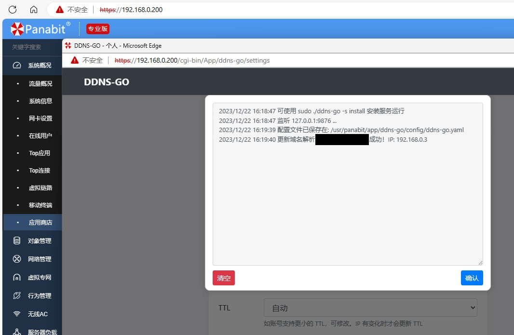

# Panabit 网关插件系列之 DDNS-GO 启动器



一个 Panabit 智能应用网关插件，可在不开启 SSH 的条件下为用户安装和维护 [jeessy2/ddns-go](https://github.com/jeessy2/ddns-go)。

本项目的主要工作：

+ 适配 Panabit 网关插件的生命周期命令和钩子，使得安装和管理可以在 Web 界面完成
+ 额外的进程管理，可以控制 DDNS-GO 的启停和开机自动启动
+ 反向代理和垫片，利用 Web 管理页隐藏上游 DDNS-GO 没有 TLS 加密的接口，且隐式支持账密保护
+ 提供了 ca-bundle.crt 的安装，便于部分无根证书环境使用

## 安装

下载 Release 版本，请先校验文件哈希无误。打开 Panabit 网关的 Web 管理页，前往**系统概况**->**应用商店**，点按右上角**安装更新**上传并安装插件即可。首次安装时，DDNS-GO 的账密将会随机生成并由本项目管理，用户后期不需要对其进行修改。

## 使用

在 Web 页面进行配置即可，管理口需要可以上网。

首次使用时，Panabit 网关控制面可能缺少 CA 证书，这将导致应用无法建立 TLS 连接。可以点按本项目提供的**更新证书**（Update Certificates）按钮，该接口将会拷贝安装包内置的 `ca-bundle.crt` 到 `/etc/ssl/certs` 目录下。该证书来自 [https://curl.se/ca/cacert.pem](https://curl.se/ca/cacert.pem)，如欲了解更多信息，请访问 [curl - Extract CA Certs from Mozilla](https://curl.se/docs/caextract.html)。

### ⚠ 潜在的安全风险告知

以命令方式获取地址的操作，将会在网关控制面以 root 用户身份执行。对于要执行的命令，请务必三思而后行，以免带来严重后果。泄露管理页面账密等行为会导致该接口暴露而容易遭到攻击，这有可能使得设备存在永久后门和漏洞。

### IPv4 使用命令取接口 IP 地址示例

通过接口名取：

```
floweye nat listproxy | grep WAN | awk '{print $5}' | grep -vE '0.0.0.0'
```

取第一个 PPPoE 拨号的接口：

```
floweye nat listproxy | grep pppoe | head -n1 | awk '{print $5}' | grep -vE '0.0.0.0'
```

## 自行构建

本地需要有 Go 语言工具链和 Linux 下常用工具。后期会提供 Docker 内构建方式。

克隆代码后，执行 `make` 命令即可。

## 相关项目

[jeessy2/ddns-go](https://github.com/jeessy2/ddns-go) 本项目的上游，DDNS 任务由其完成

[panabit-ttyd](https://github.com/szu17dmy/panabit-ttyd) 封装了一个 Web 终端模拟器的插件

## 授权许可

本项目使用 MIT 许可证。

Panabit 是北京派网软件有限公司的品牌/商标，本项目中的引用仅为辅助说明，代码等内容均与官方无关。
